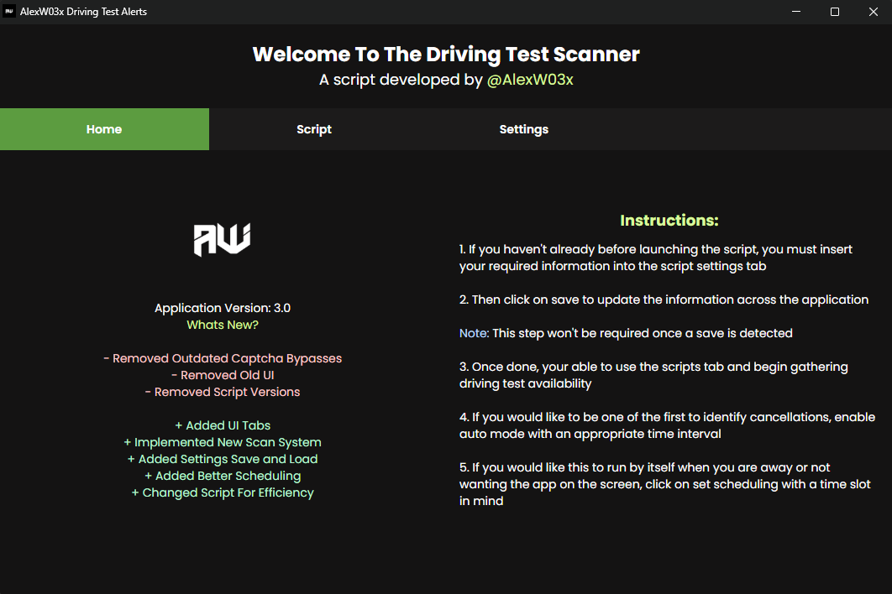

# Driving-Test-Alerts-v3
## What is it?
> Driving Test Alerts V3 is a project developed by me to help with the problem of identifying driving test availability. We don't have the time to sit and refresh the government website to find test slots and whenever cancellations occur, we will not know unless we already have an existing test booked to utilise the other services for test modifications. However, my project works to remove the need to sit and refresh and removes the need to have an existing test to identify possible tests and this project helped me get a driving test sooner too.



## Requirements
```Python
#Python | Python Language Supported Operating System | Libraries
#---------------------------------------------------------------
py -m pip install --upgrade eel
py -m pip install --upgrade seleniumbase
py -m pip install --upgrade tkinter
```

## Ethical Statement
> Due to the nature of this project, bypasses and automations have been removed to avoid violating the terms and services of the govUK and its driving agency. If you would like to use this app, please ensure that you utilise it for personal use and not for misuse and or financial gain.
